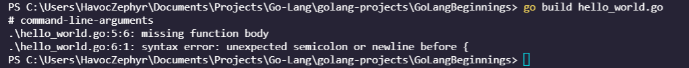
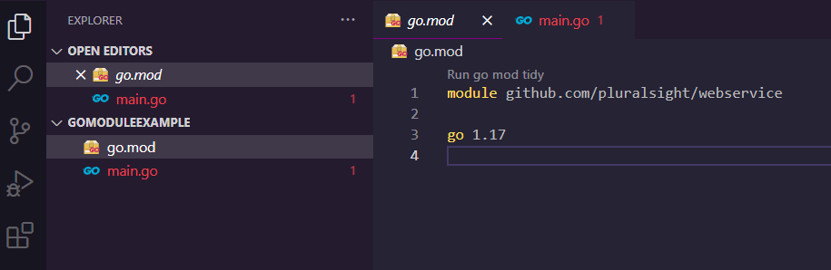

# GO: Getting Started
## By: Mike Van Sickle on Pluralsight


### **Table of Contents**
- [1-0](#introduction) **Introduction**
  - [1-1](#language-characteristics) **Language Characteristics**
  - [1-2](#what-is-go-good-at) **What is Go good at?**
  - [1-3](#hello-world) **Hello World**
- [2-0](#starting-a-project) **Starting a Project**
  - [2-1](#installing-the-go-tools) **Installing and configuring Go**
  - [2-2](#overview-of-the-go-command) **Using the Go Command**
  - [2-4](#creating-a-project) **Creating a Project**
- [3-0](#working-with-primative-data-types) **Working with Primative Data Types**
  - [3-1](#declaring-variables-with-primative-data-types) **Declaring Variables with Primative Data Types**
  - [3-2](#working-with-pointers) **Working with Pointers**
  - [3-3](#creating-constants) **Creating Constants**
  - [3-4](#using-iota-and-constant-expressions) **Using Iota and Constant Expressions**
- [?-0](#additional-resources) **Additional Resources**
  - [?-1](#go-style-guide) **Go Style Guide**


---
## **Introduction**:

### **Language Characteristics:**
[Back](#table-of-contents)

**The Problem**

Go was created a small team of engineers in Google.

At the time, Google was using 3 languages in development:
- C++
  - C++ gets very high performance. Strong Type Safety.
  - Slow Compile times, historically complex syntax.
- Java
  - Rapid Compilation and strong type safety
  - Complicated Ecosystem
- Python
  - Easy to use
  - Lacks the type safety of C++/Java and relatively slow.

Solution? Lets make GO
- Fast Compilation
- Fully Compiled
- Strongly Typed
- Concurrent by Default
- Garbage Collected
- Simplicity as a core value

### **What is Go good at?:**
[Back](#table-of-contents)

- **Web Services/Applications**
  - Google handled mostly web solutions so it's standard library is built to handle those challenges.
- Task Automation
  - Task automation is something well within go's skillset
- GUI/Thick-client
- Machine Learning

### **Hello World:**
[Back](#table-of-contents)

```go
package main

import (
  "fmt"
)
func main() {
	fmt.Println("hello world")
}
```

to compile, `go build hello_world.go`

you need to specify a package in order for the application to know where this code sits in the package.

in this case, to specify `package main` means this is the main module.

we then import the "fmt" library  to gain access to `Println`

we can write comments in go using `//`

```go
//This is an import block, it allows for multiple packages to be imported without repeating the "import" keyword.
import (
  "fmt"
)
```

```go
func main() {
  fmt.Println("hello world")
}
```
within the main package, you'll have the main function and that will always be where our application starts.

you can also perform multi line comments with `*/` and `/*`

```go
/*
The main function, when part of the main package, identifies the entry point of
an application.
*/
func main() {
    fmt.Println("hello world")
}
```

if we were to comment out the `fmt.Println("hello world")` we will get a compile error because of the fact that we have an unused import in the application, fmt. (or in the case of Visual Studio Code, it will actually just automatically *remove fmt from the import list entirely prior to building.*)

if we were to move the braces under the declared function:

```go
func main()
{
  fmt.Println("hello world")
}
```

it will fail to compile because by the rules of go, it is expecting a function declaration behind the brace.



whats happening is that golang will automatically generate those semicolons prior to compiling, and by proxy, generate semicolons in front of the function declaration as so:

```go
func main();
{
  fmt.Println("hello world");
}
```

## **Starting a Project:**

### **Installing the Go Tools**
[Back](#table-of-contents)

- go to golang.org
  - documents section contains articles that can help learn go and its use cases.
  - click "download go"
  - install go. uhhh this guy didn't really get into much more here. I prolly shoulda redacted this...
  - once its installed you can type in `go version` in terminal to see if its installed and its current version, if it doesn't appear it might be PATH issues.


### **Overview of the Go Command**
[Back](#table-of-contents)

now that we have the go tools installed, lets go to terminal and type `go` and hit enter:
```bash
Go is a tool for managing Go source code.

Usage:

        go <command> [arguments]

The commands are:

        bug         start a bug report
        build       compile packages and dependencies
        clean       remove object files and cached files
        doc         show documentation for package or symbol
        env         print Go environment information
        fix         update packages to use new APIs
        fmt         gofmt (reformat) package sources
        generate    generate Go files by processing source
        get         add dependencies to current module and install them
        install     compile and install packages and dependencies
        list        list packages or modules
        mod         module maintenance
        run         compile and run Go program
        test        test packages
        tool        run specified go tool
        version     print Go version
        vet         report likely mistakes in packages

Use "go help <command>" for more information about a command.

Additional help topics:

        buildconstraint build constraints
        buildmode       build modes
        c               calling between Go and C
        cache           build and test caching
        environment     environment variables
        filetype        file types
        go.mod          the go.mod file
        gopath          GOPATH environment variable
        gopath-get      legacy GOPATH go get
        goproxy         module proxy protocol
        importpath      import path syntax
        modules         modules, module versions, and more
        module-get      module-aware go get
        module-auth     module authentication using go.sum
        packages        package lists and patterns
        private         configuration for downloading non-public code
        testflag        testing flags
        testfunc        testing functions
        vcs             controlling version control with GOVCS

Use "go help <topic>" for more information about that topic.
```

some things to note, go comes pre packaged with testing commands, `get` helps you grab dependances, `install` helps install dependances. how neat!

### **Creating a Project**
[Back](#table-of-contents)

As of Go 1.13 and Beyond, Modules are the official way to organize source code.

Create a folder, inside the folder we need to initialize the module. we use a go.mod file similar to a requirements.txt or a package.json, in that it holds the build information of the project. for this example, it requires an argument to init so we will be using the one provided in the video
```bash
C:\code>go mod init github.com/pluralsight/webservice
```
by doing so it generates a file in your project folder:



inside it has the module it's pointing to and the version of go being used.

into our `main.go` file, lets just make what we learned early, a basic hello world.

```go
package main

import "fmt"

func main() {
	fmt.Println("Hello from a module, Gophers!")
}
```

if we save and run this project using `go run github.com/pluralsight/webservice` we will be able to run the application directly.

**my own thoughts** this whole bit is so wierd, you can't run `go mod init` without a remote repo, why do I need to point to a remote repo to create a go.mod file? this whole bit doesn't make much sense to me.

Okay, based on this url [here](https://www.digitalocean.com/community/tutorials/how-to-use-go-modules), you can make go modules local by just doing `go mod init moduleName`. I'll give it a try! aaand it worked!

## **Working with Primative Data Types**

### **Declaring Variables with Primative Data Types**
[Back](#table-of-contents)

writing variables:
```go
var i int
i = 42
```
this is the verbose syntax of representing a variable.

```go
var f float32 = 3.14
```
we can define the variable within the same line. but we can go deeper.

```go
firstname := "Arthur"
```
by using walrus `:=`, we can trigger initialiation syntax and automatically define and initialize. based on the value given it will know what kind of typing to define it.

if we try to define a variable, but then not use it. go will generate a compile error. unlike with unused packages, go will not delete the variable and its value, but it will just fail to compile and notify you.

```bash
PS C:\Users\HavocZephyr\...\GoModuleExample> go run goModExample
# goModExample
.\main.go:4:2: Tomato declared but not used
```
**my own thoughts** these compile errors are surprisingly human. I wonder if this is just how go errors are in general. it'll be nice to not have to yank out the wiki every time go gets upset.

we have our usual data types
- boolean
  - `b := true` 
  - although here we can definitely see that the T/F syntax for go is lowercase, not uppercase `True` `False` like in python/js
- float32 & float64, based on the size of the float
  - `c := 3.14159`
- Integer
  - `d := 4`
- string
  - `e := "e"
  - I've noticed go does not like single quotes, it really wants to see double quotes.
  - I found [this](https://blog.fireheart.in/a?ID=e90936fe-24de-4297-9b7a-d9b76cec5161) article on the subject, it appears that go specifically uses single quotes for single character entries :\ I wonder what this'll do to my projects if I have to embed code inside of strings.


### **Working with Pointers**
[Back](#table-of-contents)

### **Creating Constants**
[Back](#table-of-contents)

### **Using Iota and Constant Expressions**
[Back](#table-of-contents)


## **Additional Resources:**

### **Go Style Guide**
[Back](#table-of-contents)

Found [this](https://github.com/uber-go/guide/blob/master/style.md) online, seems helpful.


